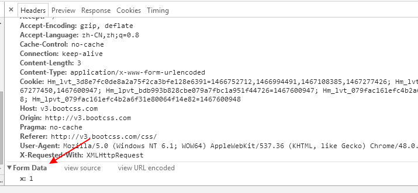
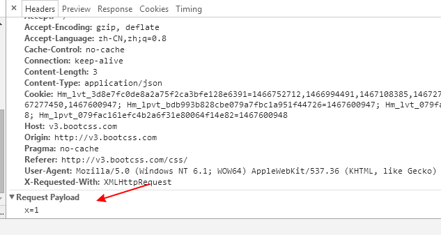
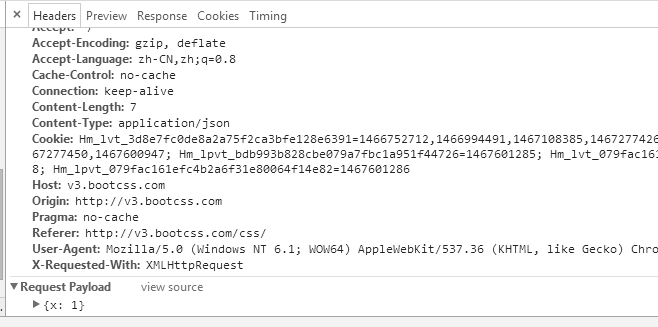

在请求中，常用的一个字段，叫做 Content-Type

``` javascript
$.ajax({
  method: 'POST',
  url: 'xxxx.action',
  data: {},
  contentType: 'application/x-www-form-urlencoded', // 默认form表单的key-value形式提交
}).then(...);
```

其格式如下:
``` html
类型格式：type/subtype(;parameter)?
type: 主类型，任意的字符串，如text，如果是*号代表所有；   
subtype: 子类型，任意的字符串，如html，如果是*号代表所有；   
parameter: 可选，一些参数，如Accept请求头的q参数， Content-Type的 charset参数。
```
例如:
``` html
Content-Type: text/html;charset:utf-8;
```

常见的媒体格式类型如下:

  1. text/html ： HTML格式
  2. text/plain ：纯文本格式      
  3. text/xml ：  XML格式
  4. image/gif ：gif图片格式    
  5. image/jpeg ：jpg图片格式
  6. image/png：png图片格式

以 application 开头的媒体格式，有:

  1. application/xhtml+xml: XHTML格式
  2. application/xml: XML数据格式
  3. application/atom+xml: Atom XML聚合格式    
  4. application/json: JSON数据格式
  5. application/pdf: pdf格式  
  6. application/msword: Word文档格式
  7. application/octet-stream: 二进制流数据（如常见的文件下载）
  8. application/x-www-form-urlencoded ： <form encType=””>中默认的encType，form表单数据被编码为key/value格式发送到服务器（表单默认的提交数据的格式）
  9. multipart/form-data: 上传文件使用

在jquery中，如果不设置 contentType 字段，默认为 application/x-www-form-urlencoded，
所有在 ``` data ``` 中的字段，将转为 key/value 的形式，所有 value，无论是什么类型，都会转为字符串。
``` javascript
$.ajax({
  method: 'POST',
  url: 'xxx.action',
  data: { x: 1 },
  contentType: 'application/x-www-form-urlencoded'
}).then(...);
```
内容，将会在 ``` Form Data ```中



如果 content-type 为 application/json，则会在 ``` Request Payload ``` 中
``` javascript
$.ajax({
  method: 'POST',
  url: 'xxx.action',
  data: { x: 1 },
  contentType: 'application/json'
}).then(...);
```


之所以看到``` x=1 ``` 完全是因为jquery对json数据，做了一层转为，改改
``` javascript
$.ajax({
  method: 'POST',
  url: 'xxx.action',
  data: JSON.stringify({ x: 1 }),
  contentType: 'application/json'
}).then(...);
```

以此方式提交，到后端时，能完整获取到json数据，包含正确的格式


-----------------------------

补充一点，
如何在后端，获取到正确的application/json数据呢？
可以使用 raw-body 这个包:

``` javascript
var getRawBody = require('raw-body')
var http = require('http')

var server = http.createServer(function (req, res) {
  getRawBody(req)
  .then(function (buf) {
    res.statusCode = 200
    res.end(buf.length + ' bytes submitted')
  })
  .catch(function (err) {
    res.statusCode = 500
    res.end(err.message)
  })
})

server.listen(3000)
```
