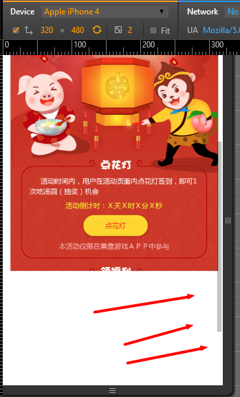

因项目需要，经常制作等比缩放的移动端页面，在此总结了几套方案，需要的同学，按实际项目需求选择。

............
XX：Why 不做响应式咧？
某熊：熊会告诉你，产品君们，只认准缩放这个坑么。
XX：..熊熊，你辛苦了
某熊：( ▼-▼ )
............


## 缩放方案

常有简洁的方案，有几种：

	1. 通过 transform: scale，样式缩放
	2. 设置 meta[name=viewport]，页面整体缩放
	3. 改写根元素[html元素]的 font-size，整体 rem 进行布局
	4. 不缩放【产品君，你再遮痒仔，洒家不管啦！

-------

### transform: scale

处于 css3 红红火火的时期，大家对 transform: scale 应该不陌生。
只要给 body 来一发 transform: scale，整个页面就缩放成需要的大小，妥妥的，但事实呢？

如，有设计稿，宽度是 640px 的，而在 320px 的屏幕下，需要给 body 设置 ``` transform: scale(0.5); ```，效果如下:

当页面滚动到最底部时，多出的空白，到底是什么鬼？？

默然回首，真相只有一个！``` transform: scale(0.5) ``` 虽然在视觉上，缩小的页面，但其实际大小、占据的空间，并没有改变。
具体可看[transform你不知道的那些事](http://sentsin.com/web/999.html)

到此为止，可看出 transform:scale 做缩放，是个坑，请果断放弃之。但是，其思想，非常值得学习，我们可以使用 zoom 代替 transform: scale，达到缩放的效果:

效果还是不错的，为什么 zoom 可以，请参考:[3金大神的文章](http://www.zhangxinxu.com/wordpress/2015/11/zoom-transform-scale-diff/)
在根元素上设置 zoom，能更好的与 rem 玩耍哦~

..........
XX：完美，得爱卿者得天下！
某熊：少年哟，文本在 zoom 的缩放下，最小是 12px 欸~
XX：( ╯□╰ )
某熊：如果木有坑货，世界充满了和平与爱
..........

-------

### meta

看一段代码
``` html
<meta name="viewport" content="width=device-width,initial-scale=1.0,minimum-scale=1.0,maximum-scale=1.0,user-scalable=no">
```
代码用于声明页面的宽度、缩放等值。移动端的同学，对此应该不陌生。
其中 ``` initial-scale=1.0```、``` minimum-scale=1.0 ```、 ``` maximum-scale=1.0 ``` 分别用于 设置页面原始、最小、最大的缩放比例。
通过修改上述3个值，可控制页面的整体缩放。

640px稿子，320px屏幕下：

效果颇肥~，就连某些同学要求的 260px 屏幕下，文字也完美缩放了。

神功大成，日出东方，唯我不败啊......
..........
H君：熊熊，屏幕小的时候，这里的文字好小欸，能单独对这块文字放大点吗？
某熊：我勒个去(-。-;)
..........

欲练神功，请熟读css媒体查询。

-----

### rem

不知道什么是 rem 的同学，请点击 [传送门](http://www.w3cplus.com/css3/define-font-size-with-css3-rem)。

通过 rem，我们可以很简单的控制页面的某一部分，根据根元素的大小，进行同步的缩放。
如有按钮:
``` css
.button {
	width: 6rem;
	height: 2rem;
}
```
如果根元素设置 ``` font-size: 10px; ```，按钮的宽高，将是: 60px、20px。
同理，如果将 ``` font-size ``` 设置为 20px，那宽高将是: 120px、40px。

页面整体使用 rem 进行布局，包括 margin、padding、top、left 之类的。只需动态计算根元素的``` font-size ```，即可完美得到一个等比缩放的页面。

限制也很明显。虽然使用了 rem，如果最后计算出的值小于 12px，浏览器则会当作 12px 处理。
如根元素设置``` font-size: 10px; ```，而按钮高度，设置为 ``` height: 1rem ```，得到按钮的高度，将会是 12px，而不是 10px。
..........
XX：用于局部，确实不错，但是 rem 计算好烦咧
某熊：px2rem 你值得拥有
..........

在不需要整体缩放的项目中，rem确实是不错的选择。
..........
某熊：哇咔咔，产品同学们，尽管放马过来！！！
H君：→ →!! 确定？
某熊：啊，刚刚天气老好了(-__-)b
..........


-----

### 不缩放

H君：顶部文字放大点
某熊：嗯~
H君：太大了，还是改小点好
某熊：嗯
H君：在小屏幕下，再放大点吧(●'◡'●)
某熊：嗯( ▼-▼ )
H君：还是小点好看，顺便再改个文案吧
某熊：[unhappy coding...]
H君：对了，页面弄回原本大小吧，老大说现在不好看。
某熊：啊啊啊啊啊！！！策划君，你够了！！！！


需要看demo的同学，[狂点这里](./demo/index.html)
