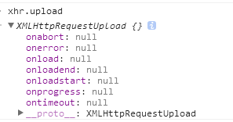
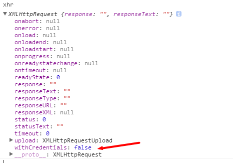

FormData 是 h5 的新对象，可以自由组装为一个新的表单对象，用于XMLHttpRequest的提交。

此对象非常简单，只有一个 append 方法:
``` javascript
var fd = new FormData();
fd.append("name", "da宗熊");
// 或
fd.append("file", file对象);
```

而在 XMLHttpRequest对象中，也新增了 upload 对象:
``` javascript
var xhr = new XMLHttpRequest();
var upload = xhr.uplad;
```

其中 upload 对象，有着好几个 onXXX 的方法:


也可以通过 addEventListener，添加相关的监听。
而需要添加 进度 的监听，则是这样子:
``` javascript
xhr.upload.addEventListener("progress", function(event){
    // event 中，包含了 total 总字节，loaded 已经上传的字节
}, false);
```

-----------

对于 XMLHttpRequest 对象，有几个 方法，也是平时没怎么留意的:


其中:

1、abort 取消请求
``` javascript
xhr.onabort = function(){
   // 取消的回调
};
// 取消当前请求
xhr.abort();
```

2、error 请求发生错误

3、load 请求完成

4、loadend 请求完毕，无论成功还是失败

5、progress 请求的进度，但是没法获取 total，只有loaded的数据，要完整进度，还是需要 xhr.upload.onprogress

6、readyState  请求的状态
``` text
0 --> 还没调用send
1 --> 已经调用send，正在开始发送
2 --> send方法执行完毕，已经收到了全部需要发送的内容
3 --> 收到响应，并且在解析响应的内容
4 --> 响应解析完毕，客户端可以使用了
```

7、status 请求的返回码
``` text
200 --> 成功
302 --> 没有修改
500 --> 服务器错误
301 --> 重定向
404 --> 找不到
```

一般而言，判定请求是否完成，需要这样子：
``` javascript
xhr.onreadystatechange = function(){
   if(xhr.readyState == 4 && xhr.status == 200){
       console.log("请求完成", xhr.responseText);
   }
};
```

8、withCredentials 如果是跨域请求，是否带上cookie信息，默认是不带上
