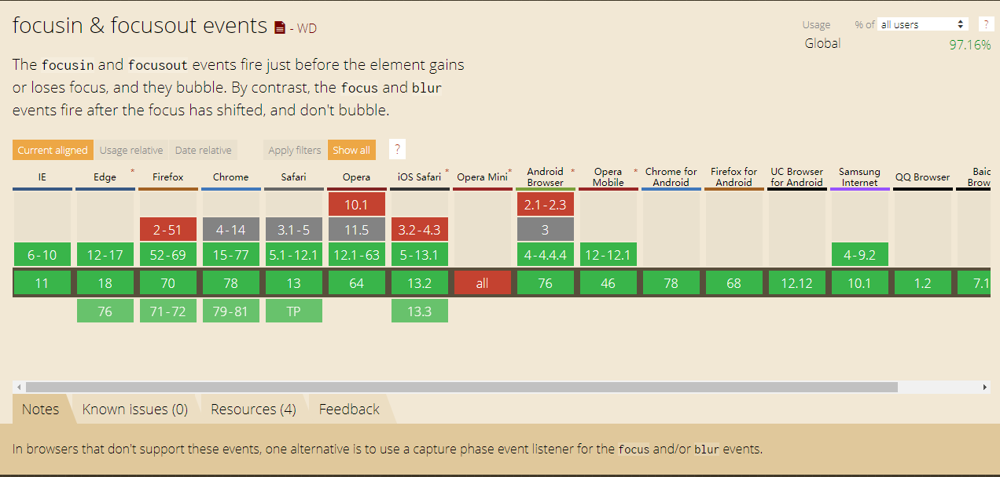
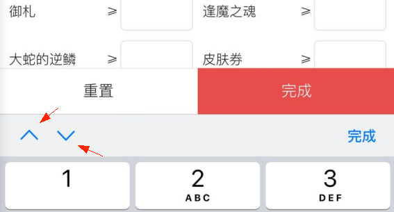

# 背景介绍

在 IOS 的 wkWebview 下，input 和 textarea 收起键盘时，一定概率导致界面错位，问题效果如下:


输入法的某些操作，会更容易触发此问题:


虽然用户滚动页面后，此问题就会自动修正，但毕竟体验不太友好。
要解决这个问题，我们可以给全体 input 和 textarea 增加 blur 时间，当输入法焦点离开时，触发一下 window.scrollTo 方法即可。


# 绑定事件

第一个想法，肯定就是事件代理了：
```javascript
document.body.addEventListener('blur', function() {
  window.scrollTo(0, 0);
}, false);
```
在 body 层，监听到 blur 事件，然后就强制触发一下滚动。
但是很遗憾的，focus 和 blur 事件，均不支持冒泡。


但作为类似的，有 focusin 和 focusout 事件，在 caniuse 上面，可看到手机上支持还不错（毕竟只管 IOS 的）。



于是代码如下:
```javascript
// 两者配套使用，记下 focusin 时的滚动位置，在 focusout 时修复
let lastScrollY = null;
document.body.addEventListener('focusin', () => { 
  lastScrollY = window.scrollY;
});
document.body.addEventListener('focusout', () => {
  window.scrollTo(0, lastScrollY);
});
```
一切很美好，直到......

部分输入法，有“完成”和“收起”两个功能，如百度输入法的数字、字母输入面板。
其中的“收起”功能，是不会触发 focusout 事件的。
如果是“收起”关闭输入法键盘，input重新获得焦点时，focusin 事件也不会触发。


心如死灰中......


果然只有 focus 和 blur 才是王道，最糟糕的场景，就是不走事件代理而已。
给每个 input 和 textarea 添加监听。
但是，
w3c的dom事件模型，实际是有 捕获 和 冒泡 两个阶段的。
虽然 focus 和 blur 冒泡阶段无法监听，但是 捕获阶段 可以。

代码变通一下:
```javascript
// 两者配套使用，记下 focus 时的滚动位置，在 blur 时修复
let lastScrollY = null;
document.body.addEventListener('focus', () => { 
  lastScrollY = window.scrollY;
}, true);
document.body.addEventListener('blur', () => {
  window.scrollTo(0, lastScrollY);
}, true);
```
完美、收工~~~


# 后来

个鬼呢，太难了。。。
实际会遇到以下的问题:

1. 多个输入框时，输入法自带的聚焦到上一个、下一个输入框的功能，会导致 blur 被触发多次，页面抖动
可增加计时器防抖

 

2. 遇到 position: fixed 有输入框的，要真正触发一下滚动位置变化一下，才能100%保证显示


于是整合的最终代码如下:
```javascript
// 下面例子，就不增加元素类型的判定了
let timer = null;
let lastScrollY = null;

document.body.addEventListener('focus', () => { 
  clearTimeout(timer);
  lastScrollY = window.scrollY;
}, true);

document.body.addEventListener('blur', () => {
  clearTimeout(timer);
  const y = lastScrollY;
  // 第一次 setTimeout 防抖，第二次为了修复 position:fixed 有输入框的场景
  timer = setTimeout(() => {
    window.scrollTo(0, y + 1);
    setTimeout(() => {
      window.scrollTo(0, y);
    }, 20);
  }, 0);
}, true);
```

另外，判断是否在 IOS 的 Webview，代码如下:
```javascript
// @see https://github.com/wuliqiangqiang/is-webview
const userAgent = navigator.userAgent;
const isIOS = !!u.match(/\(i[^;]+;( U;)? CPU.+Mac OS X/); // 网上抄录的，此判断可自己调整
const isIOSWebview = isIOS && userAgent.indexOf(" Mobile/") > 0 && userAgent.indexOf(" Safari/") === -1;
````

the end~，希望对大家有所帮助~