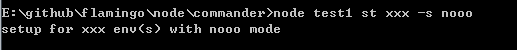

## 简介

写帮助命令，往往比较烦人，这次介绍node.js的工具包: commander。
commander 通过处理 process.argv 列表，把参数转化为更容易编程的对象:

``` javascript
var commander = require("commander");
commander.parse(process.argv);
```

一个带有帮助命令的界面，已经轻松完成了:


--------------------


## 设置Options列表

``` javascript
var commander = require("commander");
commander
    .option('-p, --ptest', 'p测试')
    .parse(process.argv);

if(commander.ptest){
    console.log("设置了ptest:" + commander.ptest);
}
```

运行命令:  -h


运行命令: -p 数据


------------------------------


## 设置当前版本、用法

``` javascript
var commander = require("commander");
    commander
        .usage('[option] <your file ...>')
        .version('0.0.1')
        .parse(process.argv);
```

运行: -h

留意usage，其中的信息，已经被更新了

运行: -V

能看到版本信息


-------------------


## 对传入参数进行处理

``` javascript
var commander = require("commander");
    commander
        .option('-i, --integer <n>', '整数', parseInt)
        .parse(process.argv);

console.log("integer: %d", commander.integer);
```

-i 接受1个参数，此参数会经过 parseInt 的操作
运行 -i 113.xx


-------------------


## 传入参数验证，验证不通过，采用默认值

``` javascript
var commander = require("commander");
    commander
        .option('-i, --integer <n>', '整数', /^\d+$/, 0)
        .parse(process.argv);

console.log("integer: %d", commander.integer);
```

参数 -i 后面必须跟着整数，否则，值为 0，如果不设置最后的值，则默认是 true 和 false


--------------------------


## 命令设置


``` javascript
var commander = require("commander");
    commander
        .command('setup [env]')	 // 设置命令，可接受1个参数
        .alias('st')	 // 设置命令别名
        .description('run setup commands for all envs')	 // 该命令的描述
        .option("-s, --setup_mode [mode]", "Which setup mode to use")	// 该命令可接受的参数
        .action(function(env, options){
            var mode = options.setup_mode || "normal";
            env = env || 'all';
            console.log('setup for %s env(s) with %s mode', env, mode);
        });

// setup xxx -s all
// 打印: setup for xxx env(s) width all mode
commander.parse(process.argv);
```

运行: setup xxx -s nooo



-------------------------


## 帮助补充

``` javascript
commander.on("--help", function(){
    console.log(' Examples:');
    console.log();
    console.log(' $ deploy exec sequential');
    console.log(' $ deploy exec async');
    console.log();
});
```

运行 -h

