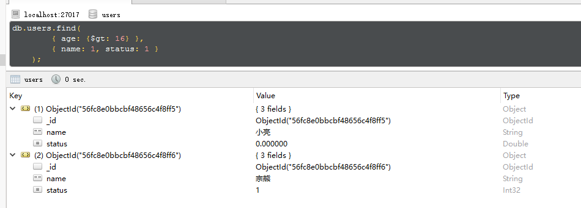
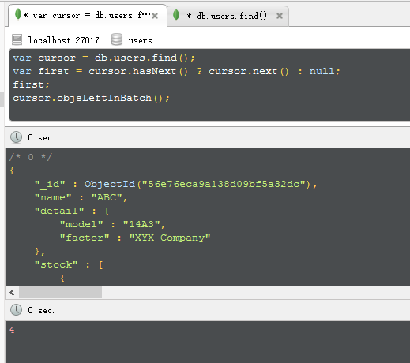
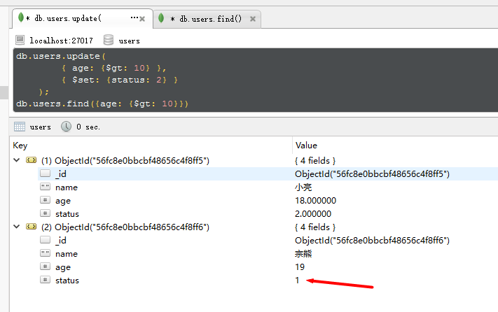
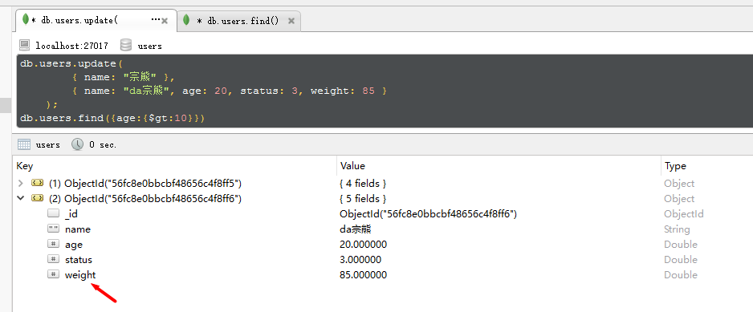

mongodb 是以文件，进行数据存储的数据库。
安装完成后，需要在C盘，亲自建立data/db文件夹【这个略坑】，才能正常使用。

之后，在安装 Robomongo【一款mongodb的图形化软件】，进行图形化的处理。
在控制台运行 mongod，正式启动db。


填好信息，connect进入。

---------------------------------

## 插入操作

插入单条数据
``` sql
    db.users.insert({
        name: "da宗熊",
        age: 11,
        detail: ["strong", "smart"]
    });
```
其中 ``` db.users ``` 是使用当前库的 users 集合

插入多条数据
``` sql
    db.users.insert([
        { name: "小亮", age: 18, status: 0 },
        { name: "宗熊", age: 19, status: 1 }
    ]);
```

集合对插入的数据，是没有限制的，就是前后插入的两条数据，格式都不一致，也是没问题的。
不知这种难题，有木有破解方案呢？


-----------------------

## 查询操作

查找所有数据
``` sql
    db.users.find();
```

查找特定数据
``` sql
    db.users.find(
        { age: {$gt: 16} },
        { name: 1, status: 1 }
    );
```
查询 age 大于 16 的所有数据，并且只返回其中的 ``` name/status/_id ``` 字段。
木有错，所有新增的数据，都会自带一个 ``` _id ``` 的字段，用于标志数据的唯一性。


搜索接受两个参数，第1个，为条件【类似where】，第2个为限制【类似返回数据列，1为返回，0不返回】。
“限制”中，除了 ``` _id ``` 其它的数据，禁止 0 和 1 混合使用。
下面的查询，报错:
``` sql
    db.users.find(
        { age: {$gt: 10} },
        { name: 1, status: 0 }
    );
```
实际也很好理解，有“限制”时，不写的，都没有返回，即默认是0，但是``` _id ``` 默认则是 1
但上面也说了 ``` _id ``` 是个例外，下面例子则没问题:
``` sql
    db.users.find(
        { age: {$gt: 10} },
        { name: 1, _id: 0 }
    );
```

注:
    搜索，设置可以查找对象的某个属性: ``` { "data.key": {$gt: 1} } ```

------------------------

## 查询限制

查询操作，可跟很多后续的操作一起使用

1、返回条数
``` sql
    db.users.find({ age: {$gt: 10} }).limit(2);
```
limit 去最前面的两条数据

2、排序
``` sql
    db.users.find().sort({ age: 1 });
```
sort 排序操作，``` age: 1 ``` 以年龄从小到大进行排序，-1则是从大到小进行排序

3、游标
``` sql
    var cursor = db.users.find();
    var first = cursor.hasNext() ? cursor.next() : null;
    first;
    cursor.objsLeftInBatch();
```
将会打印出第1条找到的数据，以及在游标中，剩下的数据量。


4、查询优化
``` sql
    db.users.createIndex({ status: 1 });
```
上述语句，创建了一个以 type 升序的索引。
如果数据有某种可用于分块的数据，创建索引后，可提高搜索效率。
注意，索引创建一次即可，不用每次查询都创建。

有两种情况，创建索引，是毫无用处的:
``` sql
    db.users.createIndex({ list: 1 });
    db.users.createIndex({ "users.login": 1 });
```
其中，如果 list 是数组，users 是个对象，则创建索引，毫无意义。

-----------------

## 更新数据

``` sql
    db.users.update(
        { age: {$gt: 10} },
        { $set: {status: 2} }
    );
```
年龄大于10的1条数据，把 status 更新为2，没错，仅1条数据:


如果要更新多条数据，可设置第3个参数为 ``` {multi: true} ```
``` sql
    db.users.update(
        { age: {$gt: 10} },
        { $set: {status: 2} },
        { multi: true }
    );
```

如果要更新某一条特定数据，可如此操作:
``` sql
    db.users.update(
        { name: "宗熊" },
        { name: "da宗熊", age: 20, status: 3, weight: 85 }
    );
```


可以看到，旧的数据中，甚至连 ``` weight ``` 也插入了。
感觉，就更 javascript 一样，保存的，其实就是个对象吧？


---------------------

## 删除数据

删除和更新的策略，恰好相反。
删除默认是把全部选中的数据删除，而更新的默认，却只处理选中的第1条数据。

``` sql
    db.users.remove(
        { age: {$gt: 10} }
    );
```

如果只想删除1条数据，可设置第2个参数，为 ``` {justOne: true} ```
``` sql
    db.users.remove(
        { age: {$gt: 10} },
        { justOne: true }
    );
```


----------------------------

## 分页

分页操作，需要 limit 和 skip 进行配合。
简单的分页:
``` sql
    db.users.find().sort({ age: 1 }).skip(0).limit(2);
```
查找第1页数据，而第二页，也以此类推
``` sql
    db.users.find().sort({ age: 1 }).skip(2).limit(2);
```

对于数据量少的网站，skip 可满足，但是 skip 效率并不高的说。
更优的方式，应该是记住上一次查询的末尾数据，下次查询以上一次末尾数据作为条件，进行查询。
