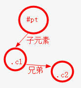
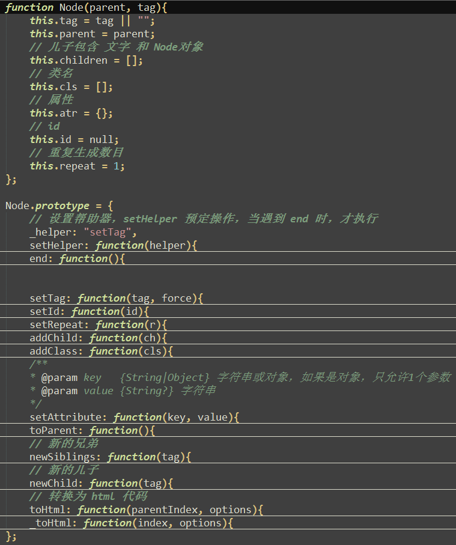
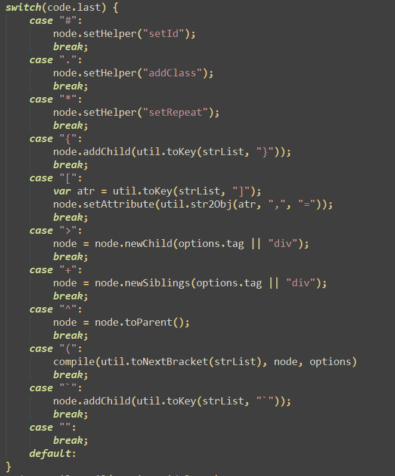

## 语法分析

关于emmet的语法，有几个常用的，在编码前，先进行介绍.

| 语法 | 作用  |
| :--------: | :--- |
| div | 指定标签，eg: "div" --> ```<div></div>``` |
| . | 指定标签的类名, eg: ".text" --> ```<div class="text"></div>``` |
| # | 指定标签的id |
| > | 子元素，eg: ".pt>.txt" --> ``` <div class="pt><div class="txt"></div></div>``` |
| + | 兄弟元素, eg: ".a+.b" --> ```<div class="a"><div class="b"></div></div>``` |
| ^ | 回到上一层, eg: ".pt1>.ch^.pt2" --> ```<div class="pt1"><div class="ch"></div></div><div class="pt2"></div>``` |
| {} | 文本内容, eg: "{文字}" --> ```<div>文字</div>``` |
| [] | 属性, eg: "[a=1 b=2]" --> ```<div a="1" b="2"></div>``` |
| \* 数字  | 元素重复出现多少次 |

不同编辑器的 emmet 语法，会有些许差异，上述只做参考。

----------

## 字符串解析

如何将一段字符，解析成 html 呢？关于这点，有两个方案：

一、正则匹配

按照 emmet 语法的特性，使用正则，对字符进行划词，及解析。因为仔细观察，其实，每一个元素，都是以 +、>、^ 这3个符号，进行划分的。划词的正则，粗略编写，如下即可:

``` javascript
var reg =  /(.*?)(\+|>|\^|$)/g;
var str = "#id>.cls";

reg.exec(str); // ⇒ ["#id>", "#id", ">"]
reg.exec(str); // ⇒ [".cls", ".cls", ""]
reg.exec(str); // ⇒ ["", "", ""]
```

二、逐字符编译

把字符串，剪切为单个字符，遇到类似 +、>、^ 等符号，进行特殊处理:

``` javascript
var str = "#id>.cls";
var list = str.split(""); // ⇒ ["#", "i", "d", ">", ".", "c", "l", "s"];
```


两种方法各有优劣，正则比较简单快速，但是遇到特殊情况，如遇到这种镶嵌情况: "{文{哈哈}字}"，就显得相当的苍白了，如果运行环境相当安全，可以选择正则的方式。

在这里，选择方法二，因为后续比较好拓展。

----------

## 节点组织

字符串解析出来的，实际上，可以组织为一个数据树。如此字符: "#pt>.ch1+.chi2"，最终解析如下:



编写一个节点类，支持相关的语法：



----------

## 工具方法

因为采用了 逐个字符编译 的方法，所以，接下来的重点，就是对 split 之后的 array 对象的查找。我们需要几个方法，帮助我们快速解析 array。

一、从array当前位置，一直寻找，直到某个指定字符未知
因为遇到像"{"，那直到 "}" 未知，它们里面的所有内容，都属于文本内容。而遇到 "[" <--> "]"，它们里面的所有内容，都属于属性。
编写方法:
``` javascript
/**
* 直到找到某个 key 为止
* @param list {Array} 数据列表，如 ["a", "b", "}"], findUntil(list, "}) ⇒ "ab"
* @param key  {String} 单个字母或正则
*/
function findUntil(list, key){
	var pre, cur = null;
	var res = [];

	 // 如果下一个字符，是 '|"|`，则尽量多匹配内容
	 //  {'这是一个{{name}}'} ===> '这是一个{{name}}' 而不是 '这是一个{{name
	 var first = list[0], matchFirst = /^('|"|`)/.test(first);
	 matchFirst && list.shift();

	 while(pre = cur, cur = list.shift()){
	     if(cur === key && pre != '\\'){
	         if(matchFirst){
	             if(pre === first){
	                 // 去掉最后一个 '|"|`
	                 res.pop();
	                 break;
	             }
	         }else{
	             break;
	         }
	     }
	     res.push(cur);
	 }
	 return res.join('');
}
```

二、找到下一个结束的括号: ")"

括号，是最烦人的玩意，因为括号内，可以再镶嵌括号，所以，找成对的括号，很有必要。

``` javascript
// 找到下一个结束的括号
// toNextBracket(["a", "b", ")", "c"]); ⇒ "ab" ["c"]
function toNextBracket(list){
    var counter = 1, res = [], str, lstr;
    while(true){
        lstr = str;
        str = list.shift();
        switch(str){
            case ")":
                if(lstr != "\\"){
                    counter--;
                }
                break;
            case "(":
                counter++;
                break;
        }
        if(counter <= 0 || !str){
            break;
        }else{
            res.push(str);
        }
    };
    return res.join("");
};
```

----------

## 编译

最后剩下的，就是对字符串split后的数组，进行解析了。方法很简单，一个循环，进行swtich/case判定即可:

;

----------

## 最后

实际上，还是编码的过程，还是遇到很多坑的，如默认标签，如 "^"符号的操作，还有更多像"data=123,age=10"转为属性之类的问题。

[完整代码在此](https://github.com/linfenpan/simple-emmet.js)

为了满足模板引擎的需求，此项目额外添加了自己的语法。
